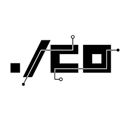

  

# Guia de uso da marca Barraco

Neste guia encontramos as cores da nossa marca e guia de aplicação do logo.

## Sumário

- [Cores](#cores)
- [Logo](#logo)

# Cores

Ao criar algum material de divulgação de **nossas iniciativas**, atente-se a seguir as cores definidas por nossos designers.

Caso seja somente a utilização do nosso logo em um material de divulgação de sua própria iniciativa, basta seguir o [guia para a aplicação do logo](#logo).

## Logo

O logotipo do Barraco é uma assinatura universal que usamos em todas os nossos projetos e nossas comunicações. É importante que ele não seja editado, alterado, distorcido ou recolorido sem a prévia autorização.

### Aplicação em fundos claros

### Aplicação em fundo escuro

### Downloads
- [SVG](./assets/svg)
- [PNG](./assets/png)
- [JPG](./assets/jpg)